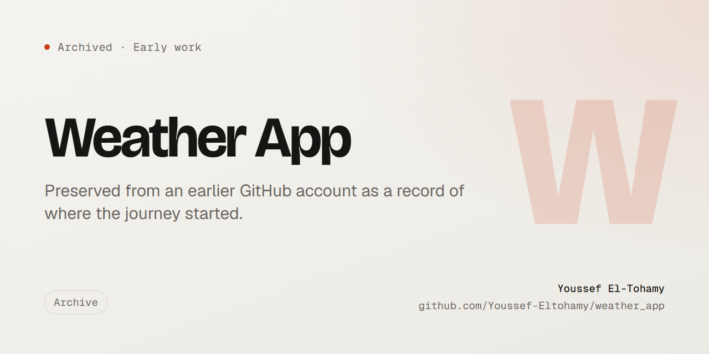

<div align="center">



**A small Flutter weather app: search a city, get the current conditions and a seven-day forecast, and watch the whole theme recolour itself to match the sky.**

[](#status)
[](https://flutter.dev)
[](https://pub.dev/packages/provider)
[](LICENSE)

</div>

---

## What it is

An early Flutter practice app, preserved from a previous GitHub account. Two screens: a home screen that
shows the weather for the selected city, and a search screen for picking one. Data comes from the
[WeatherAPI](https://www.weatherapi.com/) `forecast.json` endpoint, requested seven days at a time.

## What it demonstrates

- **`provider` for app-wide state.** A single `WeatherProvider` (`ChangeNotifier`) holds the fetched
  `WeatherModel`; both screens read from it rather than passing data down through constructors.
- **A thin service layer.** `WeatherService` owns the base URL, the query construction and the JSON
  decoding, so the widgets never touch `http` directly.
- **Model-driven theming.** `WeatherModel.getThemeColor()` maps the API's condition string to a
  `MaterialColor`, and `MaterialApp` reads it, so the app's palette follows the forecast.
- **Error surfacing.** A `400` from the API is unwrapped and rethrown with the provider's own message
  instead of failing silently on a bad city name.

## Running it

The app needs a free API key from [weatherapi.com](https://www.weatherapi.com/). Put it in
`lib/services/weather_service.dart`, replacing the `YOUR_WEATHERAPI_KEY` placeholder:

```bash
flutter pub get
flutter run
```

This is old code against old constraints. If dependency resolution fails on a current Flutter
toolchain, use an SDK contemporary with the `pubspec.yaml`.

## Status

Archived. Kept as a reference point for early work, not maintained and not accepting changes.

## License

[MIT](LICENSE).
